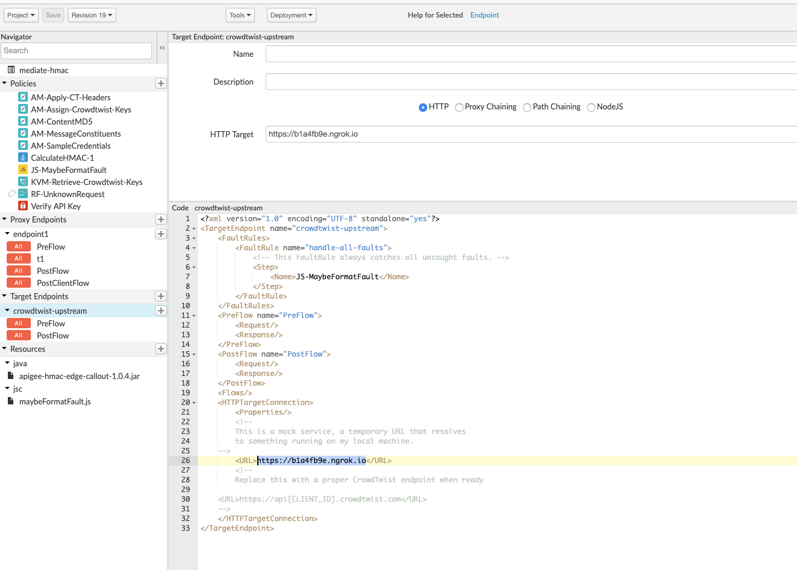

# Crowdtwist Proxy

Apigee Edge is an API Management Platform to support exposing APIs, consuming
APIs, and analytics on API traffic.

This example shows the solution to one specific "exposure" problem: security
mediation between a mobile client and a Crowdtwist backend that requires an
HMAC-based authentication mechanism.

## What it Does

[Crowdtwist](https://developers.crowdtwist.com/hmac-authentication/) requires
registration to see the API documentation. But the basic idea is: 

0. Obtain a publickey+secretkey pair from Crowdtwist. 

1. Create a string-to-sign like this: 
   ```
   StringToSign = 
   HTTP-Verb + "\n" +
   Base16(Content-MD5) + "\n" +
   Content-Type + "\n" +
   Timestamp + "\n" +
   RequestURI
   ```

2. Produce the HMAC-SHA256 using the secretkey. Encode the resulting
   byte stream as Hex (base16) and then encode _that_ as Base64.

3. Insert two headers formatted like so: 
   ```
   X-CT-Authorization: CTApiV2Auth [public key]:[encoded_signature]
   X-CT-Timestamp: [seconds-since-epoch]
   ```

This API Proxy performs those steps on behalf of a client, thereby "mediating"
the security protocol required by Crowdtwist.

## Disclaimer

This example is not an official Google product, nor is it part of an
official Google product.

## Contents

This repo includes an API proxy bundle, as well as a mock upstream that verifies the
Crowdtwist signature. 

* [proxy bundle](./proxybundles/mediate-hmac)  
  This requires some additional setup: create a developer app to obtain an 
  API Key, and also provision a Key-Value-Map to store CT credentials.
  
* [upstream](./upstreams/mockserver)  
  This requires node v10+ and npm. 
  
## Setup

The Proxy is designed to use the KVM called "plaintext" to store the Crowdtwist
credentials. The creds get stored under the key "crowdtwist_keys", in JSON format, like so: 
```
{
  "keys" : {
    "clientid1" : {
      "public" : "ABCl3y7r0s5ukCXz5lCJOCrTZ427pjp5",
      "secret" : "ABttp1b92Tb65445rmZL835f263n1q4Y"
    },

    "qTqWqfzldOst3nDA7Lke8hwUtltjqGmz" : {
      "public" : "ABCl3y7r0s5ukCXz5lCJOCrTZ427pjp5",
      "secret" : "ABttp1b92Tb65445rmZL835f263n1q4Y"
    }
  }
}
```
You can add more client ids as necessary.

The child properties under keys should be clientids known to Apigee Edge. 
Create a developer app to obtain a new client id (aka consumer key).


## Using this example with ngrok

The Proxy bundle specifies a Target HTTP endpoint of https://b1a4fb9e.ngrok.io .
This is an ephemeral URL emitted by [ngrok](https://ngrok.com/), which is a
tunneling tool that allows local services on a workstation to be visible from
the internet. To connect the proxy to your own locally-running mock upstream,
you will need to replace that target with your own ngrok endpoint.  

Here are the steps involved:

1. Open a terminal window, and run the upstream server.  (Requires node 10+)

   ```
   cd upstreams/mockserver
   npm install
   node ./server
   ```

2. Open a second terminal window, and run ngrok.  
   ```
   ngrok http 5950
   ```
   Copy the ngrok URI shown in your terminal. 
   
3. Open a browser to the Apigee Edge proxy, and modify the target URI to 
   use the URI you just copied. 
   
   
   Save the proxy and redeploy it.

4. Open a third terminal window, and invoke your proxy: 

   ```
   ORG=myorg
   ENV=myenvironment
   curl -i https://$ORG-$ENV.apigee.net/mediate-hmac/v2/activities \
     -H APIKey:XXYYYSSS
   ```
   Specify a real APIKey instead of the placeholder.


## Using it with the Actual CrowdTwist endpoint

1. Open a browser to the Apigee Edge API Proxy.  Replace the target Endpoint with  the
   appropriate https://api[CLIENTID].crowdtwist.com URL as appropriate for your
   company. 

2. Open a terminal window, and invoke your proxy: 

   ```
   ORG=myorg
   ENV=myenvironment
   curl -i https://$ORG-$ENV.apigee.net/mediate-hmac/v2/activities \
     -H APIKey:XXYYYSSS
   ```
   Specify a real APIKey instead of the placeholder.
   
## Insecure Invocation

   If you want to skip the API key verification, use the "insecure" header.

   ```
   curl -i https://$ORG-$ENV.apigee.net/mediate-hmac/v2/activities \
     -H insecure:true
   ```

   This tells the API Proxy to skip the verification of the inbound API Key. 
   It then uses the sample public+secret key from the Crowdtwist documentation
   page. 

## Dependencies

This example API Proxy depends on [the HMAC-Calculating Java callout](https://github.com/apigee/iloveapis2015-hmac-httpsignature) for Apigee
Edge. Apigee Edge will soon add a built-in HMAC policy which will eliminate the
need for this external dependency. 


## License

This material is Copyright 2019
Google LLC. and is licensed under the [Apache 2.0
License](LICENSE). This includes the Java code as well as the API
Proxy configuration.

## Bugs

* The mock upstream does not strictly verify timestamps.

* The mock server does not issue the same errors as is documented for the CT service. 

* The credentials for Crowdtwist are stored in plaintext (unencrypted). This is
  done only for demonstration purposes. Before using this proxy in production,
  modify it to use an encrypted KVM store in Apigee Edge. 


